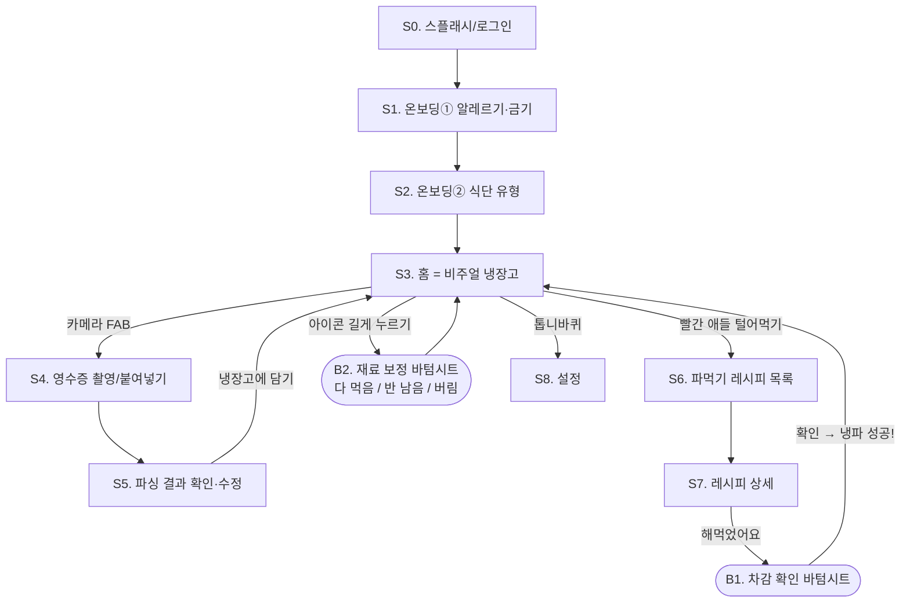

# [1차 MVP] 화면 흐름 설계

> 기준 문서: `idea.md` 8번 "1차 MVP: 냉장고 신뢰 루프 검증"
> 원칙: **화면 수를 최소로.** 1차 MVP는 딱 7개 화면(+바텀시트 2개)으로 끝낸다.
> 여기 없는 화면(식단 생성, 장보기 리스트, 월간 리포트, 공유 카드)은 2차 이후 — 지금 만들지 않는다.

---

## 전체 흐름도

> 핵심 루프는 **S3 → S4 → S5 → S3 → S6 → S7 → B1 → S3**.
> 유저가 이 원을 2주간 계속 돌면 1차 MVP 통과다. 모든 화면은 이 원을 돕는 존재여야 한다.

---

## 화면별 정의

### S0. 스플래시 / 로그인
- **역할:** 최소 마찰 진입. Supabase Auth 이메일 로그인(매직 링크)로 시작 — 소셜 로그인은 심사·설정 부담이 있어 2차.
- **완료 조건:** 로그인 성공 시, 프로필 미완성이면 S1로 / 완성이면 S3으로.

### S1. 온보딩① 알레르기·금기 (하드 제약)
- **UI:** 대표 알레르기 유발 식품 그리드 (계란·우유·땅콩·갑각류·밀·대두 등 법정 표시 대상 기준) + 직접 추가 입력.
- **"없음" 버튼을 크게** — 대부분의 유저는 여기서 3초 만에 지나간다.
- ⚠️ 여기서 받은 항목은 이후 모든 레시피에서 **절대 등장하면 안 된다** (idea.md 6번 3겹 필터).

### S2. 온보딩② 식단 유형
- **UI:** 원탭 단일 선택 — [일반] [비건] [저당] [저염]. 기본값 [일반].
- S1+S2 합쳐 **30초 안에 끝나야 한다.** 화면당 질문 1개, 그 이상 늘리지 않는다.

### S3. 홈 = 비주얼 냉장고 (앱의 심장)
- **레이아웃:**
  - 상단: 냉파 성공 카운트 뱃지 (예: 🔥 이번 달 냉파 7회)
  - 중앙: **냉장고 단면 그림** — 냉장실 선반 3칸 + 문짝 포켓 + 냉동 서랍. 재료는 카테고리별 지정석에 아이콘으로 배치. 신선도 색 테두리(초록/노랑/빨강) + 채움 게이지/개수 뱃지.
  - 우상단 토글: **아이콘 뷰 ↔ 리스트 뷰** (품목 20개 초과 시 검색성 보완)
  - 하단 고정 버튼: 빨간 재료가 1개 이상이면 **"🚨 빨간 애들 털어먹기"** (→ S6). 없으면 "오늘 뭐 해먹지?" (→ S6, 노랑·초록 기반 추천)
  - FAB(＋): 영수증 촬영 (→ S4)
- **빈 냉장고 상태(첫 진입):** 냉장고가 텅 빈 일러스트 + "영수증을 찍으면 냉장고가 채워져요" → FAB 강조. 첫 경험이 여기서 갈린다.
- **인터랙션:** 아이콘 탭 = 상세 팝오버(이름·양·신선도 D-day 추정치) / 아이콘 길게 = B2 보정 바텀시트.

### S4. 영수증 촬영 / 구매내역 붙여넣기
- **탭 2개:** [📷 영수증 찍기] [📋 텍스트 붙여넣기(쿠팡·컬리 주문내역)]
- 촬영 후 업로드 → 로딩 상태(파싱 중 문구: "영수증을 읽고 있어요…") → S5.
- **실패 처리:** 파싱 실패 시 재촬영 유도 + "직접 추가" 탈출구 제공. 에러를 삼키지 않는다.

### S5. 파싱 결과 확인·수정 (신뢰의 관문)
- **역할:** LLM 파싱 결과를 유저가 확정하는 화면. **여기서 틀린 게 냉장고에 들어가면 신뢰 루프가 시작부터 깨진다.** 1차 MVP에서 공들일 화면 1순위.
- **UI:** 인식된 품목 리스트 — 각 행: 아이콘 후보 + 품명(수정 가능) + 수량 + 추정 보관기간(수정 가능). 행 삭제/추가 가능.
- 식재료가 아닌 품목(휴지, 세제)은 LLM이 미리 제외하되, 제외 목록도 접힌 영역으로 보여줘 오탐을 구제.
- **완료:** "냉장고에 담기" → 담기는 애니메이션과 함께 S3 복귀 (재료가 냉장고 칸으로 들어가는 모션 = 보상감).

### S6. 파먹기 레시피 목록
- **정렬:** 빨강 재료 소진 기여도 순. 각 카드: 요리명 + "내 냉장고 재료 ○개로 가능" + 소진되는 임박 재료 하이라이트.
- **엔진:** idea.md 6번 — 공공 DB 커버리지 검색 → LLM 변형. 하드 제약 3겹 필터 통과분만 노출.
- 결과 로딩 중 스켈레톤 UI (LLM 변형은 몇 초 걸릴 수 있음).

### S7. 레시피 상세
- **재료 섹션이 핵심:** 내 냉장고에 **있는 재료(✔ + 현재 양)** / **없는 재료(구분 표시)** 를 시각적으로 분리. "이 요리로 빨간 재료 2개가 살아납니다" 안내.
- 조리 순서: 단계별 큰 글씨 (요리하며 폰을 볼 때 읽히도록).
- 하단: [▶ 유튜브에서 영상 보기] = 검색 딥링크 버튼 (API 아님).
- 최하단 고정: **[🍳 해먹었어요]** → B1.

### B1. 차감 확인 바텀시트
- **역할:** "해먹었어요"가 무엇을 차감하는지 투명하게 보여주고 확정. (몰래 차감하면 냉장고가 어긋났을 때 유저가 원인을 모른다)
- **UI:** 차감 목록 — 재료명 + 차감량(스테퍼로 조정 가능: "두부 반 모만 썼어요"). [확인] → 차감 실행.
- **차감 직후:** 임박(빨강/노랑) 재료가 포함됐으면 **"냉파 성공! 🔥"** 풀스크린 토스트 + 카운트 증가 → S3 복귀.

### B2. 재료 보정 바텀시트 (아이콘 길게 누르기)
- **버튼 3개: [다 먹음] [반 남음] [버림]** — 앱 레시피 없이 요리한 날, 재료를 버린 날의 저마찰 보정 경로.
- '버림'은 사유 없이 원탭 (죄책감 UX 금지 — 버림 기록은 리포트 데이터일 뿐, 유저를 혼내는 도구가 아니다).

### S8. 설정
- 프로필 수정(알레르기·금기, 식단 유형), 로그아웃, 개인정보 처리방침 링크. 그 이상 넣지 않는다.

---

## 화면 ↔ 킬러 기능 매핑 (검증용)

| 킬러 기능 (idea.md 3번) | 담당 화면 |
| :--- | :--- |
| 1. 영수증/구매내역 자동 연동 | S4, S5 |
| 2. 신호등 시스템 | S3(색 테두리), S6(빨강 우선 추천) |
| 3. 비주얼 냉장고 | S3, B2 |
| 4. 이커머스 딥링킹 | — (2차. 1차에 없음) |
| 5. 냉파 챌린지 | S3(카운트 뱃지), B1(냉파 성공 토스트) |

## 개발 순서 제안 (작게 나눠서)

1. S3 골격 (더미 데이터로 냉장고 그리기) — 앱의 심장부터
2. S4→S5→S3 입력 루프 (영수증 → 파싱 → 담기)
3. S6→S7→B1 소비 루프 (추천 → 상세 → 차감)
4. S0~S2 온보딩 + 하드 제약 필터 연결
5. B2 보정, S8 설정, 마감 다듬기

> 각 단계가 끝날 때마다 실행해서 눈으로 확인하고 커밋한다. (CLAUDE.md 워크플로우)
